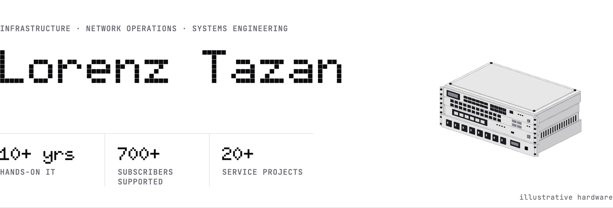

<picture>
  <source media="(prefers-color-scheme: dark)" srcset="assets/header-dark.png">
  
</picture>

Building reliable infrastructure and solving complex technical problems across network operations, systems administration, and automation. 10+ years of hands-on experience delivering high-availability systems for enterprise, ISP, and DoD contractor environments.

[lorenztazan.com](https://lorenztazan.com) &nbsp;·&nbsp; [lorenztazan@gmail.com](mailto:lorenztazan@gmail.com)

 

<h2><picture><source media="(prefers-color-scheme: dark)" srcset="assets/label-what-i-do-dark.png"></picture></h2>

I specialize in infrastructure reliability and network operations, whether that's managing distributed server environments, deploying secure DoD contractor networks, or maintaining ISP-grade systems serving hundreds of concurrent users. My focus is on uptime, performance, and proper documentation.

<h2><picture><source media="(prefers-color-scheme: dark)" srcset="assets/label-focus-dark.png"></picture></h2>

- Network operations and infrastructure monitoring
- High-availability system design and maintenance
- Security compliance for government contractors
- Infrastructure automation and operational efficiency
- Full-stack web development for local businesses (freelance)

<h2><picture><source media="(prefers-color-scheme: dark)" srcset="assets/label-track-record-dark.png"></picture></h2>

- **99.9% uptime** managing distributed infrastructure serving 300+ concurrent users
- **99.8% availability** operating ISP network supporting 700+ subscribers
- **56% latency reduction** through performance optimization and infrastructure tuning
- **24/7 operations experience** with on-call support and incident response

<h2><picture><source media="(prefers-color-scheme: dark)" srcset="assets/label-stack-dark.png"></picture></h2>

**infrastructure & operations** 
`Docker` `Kubernetes` `Linux (Debian/Ubuntu)` `nginx` `Apache` `CI/CD` `Git` `GitHub Actions` `Jenkins` `Terraform` `Ansible`

**network operations** 
`MikroTik RouterOS` `pfSense` `Ubiquiti (UDM Pro, UniFi)` `F5 BIG-IP` `Cisco patterns` `OpenVPN` `TCP/IP` `VLAN design` `VPN` `BGP` `MPLS`

**systems & databases** 
`MariaDB` `MySQL` `PostgreSQL` `MongoDB` `Redis` `SQLite` `Performance tuning` `Clustering` `Replication`

**monitoring & automation** 
`Prometheus` `Grafana` `Kibana` `Bash scripting` `Python automation` `Infrastructure as Code` `Documentation`

**languages** 
`Python` `Java` `JavaScript` `TypeScript` `Bash` `PHP` `C` `C++`

**frameworks & web** 
`Spring Framework` `Maven` `FastAPI` `Node.js` `Express` `React` `Next.js` `Astro` `GSAP` `Tailwind CSS` `Vite` `Cloudflare Workers`

**ai & agentic systems** 
`ChatGPT` `Claude` `Gemini` `LangChain` `n8n`

**cloud** 
`Azure` `AWS` `Google Cloud`

<h2><picture><source media="(prefers-color-scheme: dark)" srcset="assets/label-projects-dark.png"></picture></h2>

**ai & intelligent automation**

- [AI Agentic Network Automation](https://github.com/AIKUSAN/ai-agentic-network-automation): multi-LLM orchestration with GPT-4, Claude and Gemini for autonomous network operations
- [NetOps Automation Framework](https://github.com/AIKUSAN/netops-automation-framework): Python-based GitOps framework with Ansible, Terraform and CI/CD integration

**network infrastructure**

- [Regional Fiber ISP: Core Network](https://github.com/AIKUSAN/regional-fiber-isp): 10Gbps backbone serving 700+ subscribers (MikroTik/BGP/CGNAT)
- [Global Traffic Manager](https://github.com/AIKUSAN/global-traffic-manager): geographic traffic steering with intelligent health monitoring
  - F5 BIG-IP GTM with custom Lua iRules
  - AI-powered failover analysis and incident reporting
  - 40% latency reduction through proximity-based routing

**devops & cloud infrastructure**

- [Container Orchestration & Infrastructure](https://github.com/AIKUSAN/docker-kubernetes-automation): production Kubernetes deployments with GitOps and monitoring
  - Automated deployment pipelines reducing deployment time 93%
  - Infrastructure as Code for reproducible environments
  - Container orchestration for high-availability applications
- [Bash DevOps Toolkit](https://github.com/AIKUSAN/bash-devops-toolkit): automation scripts for infrastructure management and deployment
  - System administration utilities
  - Deployment automation for multi-environment infrastructure
  - Operational efficiency tools for daily workflows
- [MariaDB Performance Optimization](https://github.com/AIKUSAN/mariadb-optimization-guide): clustering, replication, and 56% latency reduction techniques

**web development (freelance)**

Full-stack web development for local Southern Maryland businesses.

- **Tori Tazan Portfolio** ([toritazan.com](https://toritazan.com)): professional illustrator portfolio with custom Astro + GSAP animations
- **Proven Training Concepts** (in development): corporate website for a DoD contractor with Cloudflare Workers deployment

<h2><picture><source media="(prefers-color-scheme: dark)" srcset="assets/label-activity-dark.png"></picture></h2>

<picture>
  <source media="(prefers-color-scheme: dark)" srcset="https://raw.githubusercontent.com/AIKUSAN/AIKUSAN/output/pet-dark.svg">
  
</picture>

